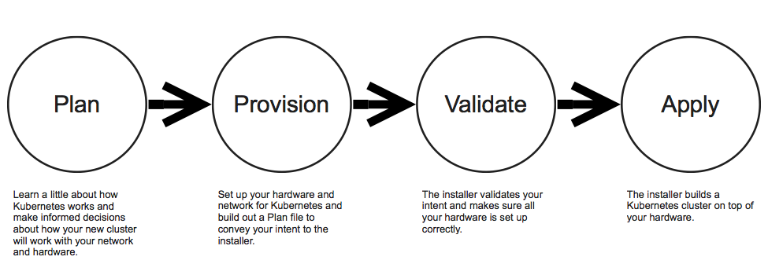

# KET Installation Overview

[CLI documentation](https://github.com/apprenda/kismatic/tree/master/docs/kismatic-cli)

## What the Kismatic CLI will do:

* Use key-based SSH to manage machines in a Kubernetes cluster
* Validate that machines and network have been properly provisioned for a Kubernetes installation
* Generate SSL certificates for internal Kubernetes traffic
* Install and properly configure Calico that Kubernetes will use for Pod and Service traffic
* Install and properly configure Kubernetes control plane components
* Install useful add-ons such as a Docker Registry, Kubernetes DNS and the native Kubernetes Dashboard
* Allow for the addition of worker nodes to an existing cluster built with Kismatic
* Allow for the installation of basic Ingress

## What the CLI will **not** do:

* Allow you to manage Kubernetes clusters that weren't built using Kismatic
* Provision infrastructure (make machines or alter your network)
* Install load balancers

# Kismatic Install Workflow

First, review the following document to learn about a few example Kubernetes cluster deployment architectures and the various approaches therein: [know what you want to build and how you want to build it](INTENT.md).

| [Plan](PLAN.md) | [Provision](PROVISION.md) | [Validate](#validate) | [Apply](#apply) |
| --- | --- | --- | --- |
| Read these docs to learn more about the resources Kubernetes will require of your infrastructure provider. You may engage with other departments in your organization (storage, network, security, IT, etc.) to make decisions and arrange required work. | Work with infrastucture providers to build out the machines and network changes that you'll need to install Kubernetes. Collect information about your infrastructure and enter it into a Plan File. | Kismatic will check the readiness of the machines and network you've specified in the Plan File. | Kismatic will configure the machines you've specified in the Plan File and run a smoke test to ensure that the resulting cluster is usable.|

1. **Plan**: `kismatic install plan`
   1. The installer will ask basic questions about the intent of your cluster.
   2. The installer will produce a `kismatic-cluster.yaml` file which you will edit to capture your intent.
2. **Provision**
   1. Provision machines
      1. Allocate hardware (bare metal machines, VMs, EC2 instances).
      2. Open access to the installer.
      3. Optionally install software packages.
   2. Provision networking
      1. Find convenient CIDR blocks for Kubernetes components.
      2. Decide on network type (overlay or routed).
      3. Open up ports where necessary.
      4. Optionally add load balancing to Master nodes.
   3. Review the installation plan in `kismatic-cluster.yaml` and add information for each node.
3. **Install**: `kismatic install apply`
   1. Every install phase begins by validating the plan and testing the infrastructure referenced within it.
   2. If the installation plan is valid, the installer will build you a cluster.
      1. Validate that nodes are provisioned correctly.
      2. Install (or validate) software packages including Docker and Kubernetes.
      3. Generate TLS certificates and keys for intra-cluster communications.
      4. Configure the cluster.
      5. After configuration, run a smoke test to ensure that scaling and pod networking are working as prescribed.

# Validate

If you're confident about the structure of your plan file and the state of your cluster, validation will be performed during `install apply` as well. Feel free to throw caution to the wind.

Having updated your plan, from your installation machine, run:

`./kismatic install validate`

This will cause the installer to validate the structure and content of your plan, as well as the readiness of your nodes and network for installation.  Any errors detected will be written to stdout.

This step will result in the copying of the kismatic-inspector to each node via ssh. You should expect it to fail if all your nodes are not yet set up to be accessed via ssh; in this case, only the failure to connect (not the readiness of the node) will be reported.

# Apply

Having a valid plan, from your installation machine, run:

`./kismatic install apply`

Kismatic will connect to each of your machines, install necessary software and prove that the cluster and network are working as intended. Any errors detected will be written to stdout.

Congratulations! You've got a Kubernetes cluster. Enjoy.

# Using Your Shiny New Cluster

The installer automatically configures and deploys [Kubernetes Dashboard](http://kubernetes.io/docs/user-guide/ui/) in the cluster.

Simply open the link provided at the end of the installation in your browser to use it; this link will be in the form of `https://%load_balanced_fqdn%:6443/ui`, using `%load_balanced_fqdn%`(from your `kismatic-cluster.yaml` file).

You will also be prompted for credentials, use `admin` for the **User Name** and `%admin_password%` (from your `kismatic-cluster.yaml` file) for the **Password**.

The installer also generates a [kubeconfig file](http://kubernetes.io/docs/user-guide/kubeconfig-file/) required for [kubectl](http://kubernetes.io/docs/user-guide/kubectl-overview/), just follow the instructions provided at the end of the installation to use it.
