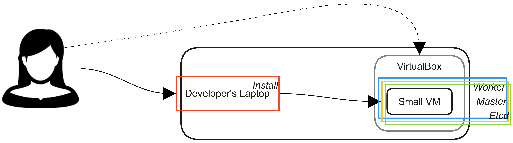
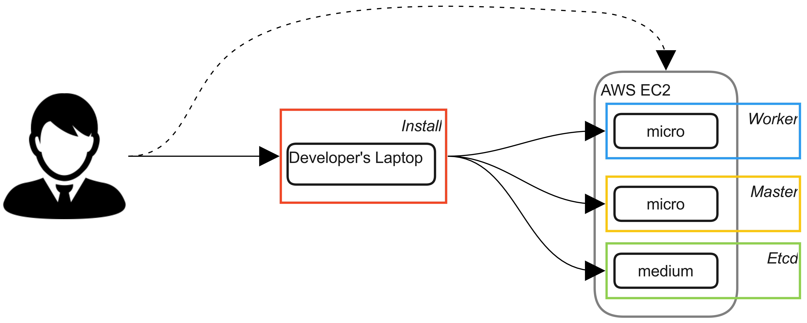
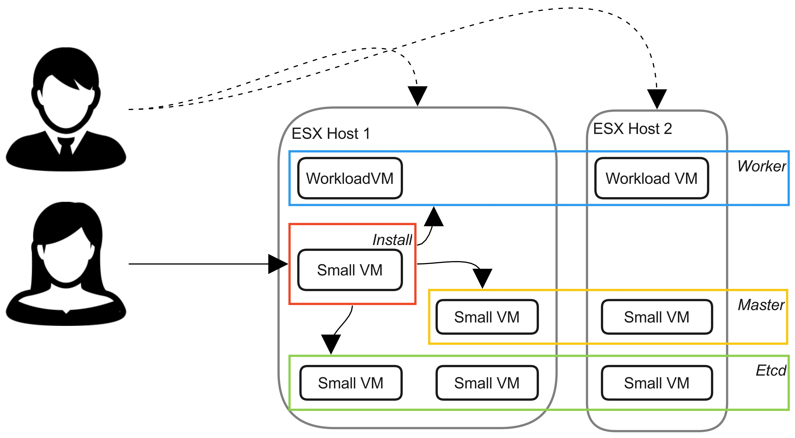
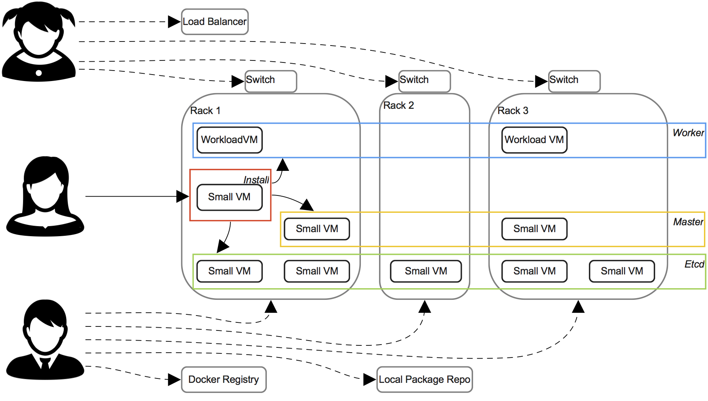

# Cluster Intent Examples

| Why do you want to install Kubernetes? | Example Cluster | Machines needed
| --- | --- | --- |
| I want to run a small prototype cluster on my laptop| [Mini-style](#minikube) | 1
| I want to run a small development cluster in AWS | [Developer](#junior) | 3+
| I want to run a reliable, permanent labratory cluster to host services mostly for my team. | [Skunkworks](#skunkworks) | 7+
| I want to run a reliable, permanent production cluster to host services for my team and others. | [Production](#production) | 9+

# Minikube style

*Just heard about Kubernetes. Love Docker and want to see what the fuss is about!*

## What you need:

* A laptop or PC/Mac (Running OSX or Linux)
* A desktop virtualizer (such as Oracle VirtualBox)
* A VM lifecycle tool (such as Vagrant) can dramatically improve set up time for virtual machines

## How you install:

1. Download the [latest Kismatic](PROVISION.md#get) for your OS and unpack it somewhere convenient.
2. Create a [small Linux VM](PLAN.md#compute)
   * You will need to know its IP address and short name.
   * You will need to create a user with passwordless auth, ssh capability and a [public key](PROVISION.md#access).
3. Run `./kismatic install plan`; you will be creating 1 of each node
4. Open the `kismatic-cluster.yaml` file in a text editor
   * Set `allow_package_installation: true`
   * Update your user and public key if necessary.
   * Enter the machine's short hostname as the `load_balanced_fqdn` and `load_balanced_short_name`
   * Add your one machine's IP and short hostname as a node in the section for each type of node -- etcd, worker and master.
5. Run `./kismatic install apply`
6. Congratulations! You have your first cluster.

# 1/1/1+ Developer's Cluster

*I'm loving the Kubernetes and want to share it with the rest of my team, maybe give them each their own little cluster to play with.*

## What you need:

* A laptop or PC/Mac (Running OSX or Linux)
* An AWS account

## How you install:

1. Download the [latest Kismatic](PROVISION.md#get) for your OS and unpack it to `~/kismatic`
2. Make a new [Keypair](https://aws.console.aws.amazon.com/ec2/v2/home?#KeyPairs:sort=keyName) for your cluster. Download its private key to `~/kismatic/kismaticuser.key` 
3. `chmod 0600 kismaticuser.key` to allow its use for SSH 
3. Make 2 small (micro) instances using Ubuntu 16.04 or RHEL. One of these will be your etcd and the other will be your master.
   * Assign public IPs -- we can always remove them later, but this will ease installation
   * Add the new instances to a security group that will allow access to any port from your machine
   * Be sure to select your new keypair on creation
4. Make 1 or more medium or larger instances using Ubuntu 16.04 or RHEL. This is your worker pool. 
   * Assign public IPs -- we can always remove them later, but this will ease installation
   * Add the new instances to a security group that will allow access to any port from your machine
   * Be sure to select your new keypair on creation
5. Run `./kismatic install plan`; you will be creating 1 of each node (more if using more workers)
6. Open the `kismatic-cluster.yaml` file in a text editor
   * Set `allow_package_installation: true`
   * Update your user (`ubuntu` for Ubuntu, `ec2-user` for RHEL)
   * Add your nodes to the sections for etcd, master and worker(s), being sure to set up the medium or larger instance(s) as worker(s) 
     * `host:` Use the Private DNS Name (these will be in the form `ip-XX-XX-XX-XX`)
     * `ip:` Use the Public IP Address
     * `internal_ip:` Use the first Private IP
   * Enter the master's short hostname as the `load_balanced_fqdn` and `load_balanced_short_name`
7. Run `./kismatic install apply`
8. Congratulations! You have your first cluster.

# 3+/2/2+ Skunkworks Cluster

*I would like to build and grow a production cluster for my team to share and work with. I don't need to share much with other people in the company, want to avoid introducing complexity to our network or I prefer the security of not having all of my Kubernetes pods addressable automatically by anybody with access to the network. This is a production environment, but we can probably survive a major disaster so long as it is low risk to workloads.*

## What you need:

* An AWS account, bare metal machines or a bunch of VMs
* An engineer with access to provision hardware

## How you install:

1. Take a meeting between the parties responsible for the network infrastructure, machine infrastructure and the cluster you are building
2. Discuss the size of the cluster and its machines -- both initial and considering six months to a year of growth.
3. Discuss [HA needs](PLAN.md#planning-for-etcd-nodes)
4. Discuss the need for a local package repository and a docker registry.

### Hardware Provisioner
1. Make an **install machine**. This is a small (1 CPU, 1 GB ram, <8 GB hard drive) basic Linux VM with an encrypted disk and very limited access -- just potential cluster administrators.
2. Create an [RSA keypair](https://github.com/apprenda/kismatic/blob/master/docs/PROVISION.md#providing-access-to-the-installer) on the install machine under `/opt/kismatic`
3. Make at least 5 more small machines -- these will be your etcd and master machines 
   * Machines must have a `kismaticuser` with
     * sudo access to root
     * Public Key auth for sudo & sshd
     * The public key generated above in `~/.ssh/id_rsa.pub`
   * You may choose to [pre-install](PROVISION.md#pre-install-configuration) packages, or let Kismatic install them for you.
     * It's okay to make a golden image of each if it improves your workflow. Runtime configuration will be set up by kismatic
   * A lab that does not have internet access will require the following:
     * [Syncing a local repository with Kismatic](PACKAGES.md).
     * A Docker Registry (which can be installed optionally with kismatic) with Kismatic's container dependencies included.
   * Both Etcd and Master machines should be spread across hardware within your datacenter to provide availability in the event of a network or hardware failure
4. Make your worker pool (2 or more machines, each sized to hold your largest workload) 
   * Don't oversubscribe. Let Kubernetes have entire cores. This will allow you to get the maximum benefit from Kubernetes' binpacking capabilities.
   * Machines must have a `kismaticuser` with
     * sudo access to root
     * Public Key auth for sudo & sshd
     * The public key generated above in `~/.ssh/id_rsa.pub`
   * You may choose to [pre-install](PROVISION.md#pre-install-configuration) packages, or let Kismatic install them for you.
     * It's okay to make a golden image of each if it improves your workflow
   * A lab that does not have internet access will require the following:
     * [Syncing a local repository with Kismatic](PACKAGES.md).
     * A Docker Registry (which can be installed optionally by Kismatic) with Kismatic's container dependencies included.
   * Spread machines across hardware within your datacenter to provide availability in the event of a network or hardware failure
5. Add a load balanced endpoint for the master nodes
   * If you have an internal load balancer that offers Virtual IP based load balancing, use that to balance between master nodes
   * If you have access to a DNS, use a CNAME with both master nodes  
6. Open up [network rules](docs/PLAN.md#firewall-rules) for your machines

### Cluster Administrator
1. Download the [latest Kismatic](PROVISION.md#get) for Linux and unpack it to `/opt/kismatic` on the **install machine**.
3. Run `./kismatic install plan`
4. Open the `kismatic-cluster.yaml` file in a text editor
   * If the default CIDR blocks for pod and service networks overlap with IP ranges already in use on your network, you will need to change them.
   * If you have no already installed Kismatic packages, set `allow_package_installation: true`
   * If you do not have DNS for this cluster, enable `update_host_files: true` to ensure connectivity between nodes
   * Update your user & key 
   * If you would like Kismatic to stand up a local docker registry, set `setup_internal: true`
     * Optionally, you can identify an existing on-site Docker Registry.
   * Enter the load balanced endpoint name in the `load_balanced_fqdn` and `load_balanced_short_name` fields
   * Add your nodes to the sections for etcd, master and worker(s), being sure to set up the medium or larger instance(s) as worker(s) 
     * `host:` Use a short name that's accessible to
     * `ip:` This is an ip address that can be used to ssh into the node
     * `internal_ip:` This is the ip address that nodes should use to talk to each other
5. Run `./kismatic install apply`
6. Congratulations! You have a skunkworks cluster. Build something bold!

# 5+/2+/2+ Production Cluster

*I want to build and grow a big cluster for my team to share their apps with the rest of the company. Security is a secondary concern to access. Also, this is production: we can't take any chances.*

## What you need:

* Bare metal machines or a bunch of VMs
* An engineer with access to your network equipment
* An engineer with access to provision hardware

## How you install:

1. Take a meeting between the parties responsible for the network infrastructure, machine infrastructure and the cluster you are building
2. Discuss the size of the cluster and its machines -- both initial and considering six months to a year of growth.
   * You should also allocate enough capacity to handle hardware failure...for example, in the three rack cluster above, if we wanted to absorb the failure of a rack, we would need 50% more worker capacity on each of the other nodes. 
3. Discuss [HA needs](PLAN.md#planning-for-etcd-nodes)
4. Discuss [the network](PLAN.md#network)
   * You're going to be using a Calico routed network, which announces pod IPAM responsibilities to the local network via BGP.
   * You will need to size and allocate an IP block to the cluster that will be accessible by the local network
5. Discuss the need for a local package repository and a docker registry.

### Hardware Provisioner
1. Make an install machine. This is a small (1 CPU, 1 GB ram, <8 GB hard drive) Linux VM with an encrypted disk and very limited access -- just potential cluster administrators.
2. Create an [RSA keypair](https://github.com/apprenda/kismatic/blob/master/docs/PROVISION.md#providing-access-to-the-installer) on the install machine under `/opt/kismatic`
3. Since this is a larger cluster, much bandwidth will be saved by [Syncing a local repository with Kismatic](PACKAGES.md)
4. You will also want to sync a local Docker Registry (one can be installed optionally with Kismatic) with Kismatic's container dependencies
3. Make at least 5 more [small machines](PLAN.md#hardware--operating-system) -- these will be your etcd and master machines 
   * Don't oversubscribe. Let Kubernetes have entire cores. This will help ensure the stability of etcd
   * Machines must have a `kismaticuser` with
     * sudo access to root
     * Public Key auth for sudo & sshd
     * The public key generated above in `~/.ssh/id_rsa.pub`
   * You may choose to [pre-install](PROVISION.md#pre-install-configuration) packages, or let Kismatic install them for you.
     * It's okay to make a golden image of each if it improves your workflow. Runtime configuration will be set up by kismatic
   * Both Etcd and Master machines should be spread across hardware within your datacenter to provide availability in the event of a network or hardware failure
   * It's a good idea to backup the data of at least one etcd node regularly (many times per day). These logs are stored in `/var/lib/etcd_k8s` and `/var/lib/etcd_networking`
4. Make your worker pool (2 or more machines, each sized to hold your largest workload) 
   * Don't oversubscribe. Let Kubernetes have entire cores. This will allow you to get the maximum benefit from the binpacking aspect of Kubernetes' schedulers.
   * Machines must have a `kismaticuser` with
     * sudo access to root
     * Public Key auth for sudo & sshd
     * The public key generated above in `~/.ssh/id_rsa.pub`
   * You may choose to [pre-install](PROVISION.md#pre-install-configuration) packages, or let Kismatic install them for you.
     * It's okay to make a golden image of each if it improves your workflow
   * Spread machines across hardware within your datacenter to provide availability in the event of a network or hardware failure.

### Network Provisioner
1. Identify a [CIDR block](PLAN.md#pod-and-service-cidr-blocks) not currently in use on your local network for use by Kubernetes as a pod network
2. Peer your existing top of rack switches with Calico's AS Number
3. Add a load balanced endpoint for the master nodes
   * If you have an internal load balancer that offers Virtual IP based load balancing, use that to balance between master nodes
   * If you have access to a DNS, use a CNAME with both master nodes  
4. Open up [network rules](docs/PLAN.md#firewall-rules) for all machines
5. Make sure that the CIDR blocks that will be managed by Kubernetes are not available to DHCP or in use by any other IP address manager. This could cause IP collisions.

### Cluster Administrator
1. Download the [latest Kismatic](PROVISION.md#get) for Linux and unpack it to `/opt/kismatic` on the **install machine**.
3. Run `./kismatic install plan`
4. Open the `kismatic-cluster.yaml` file in a text editor
   * Set `type: routed`
   * If the default CIDR blocks for pod and service networks overlap with IP ranges already in use on your network, you will need to change them.
   * If you have no already installed Kismatic packages, set `allow_package_installation: true`
   * If you do not have DNS for this cluster, enable `update_host_files: true` to ensure connectivity between nodes
   * Update your user & key 
   * If you would like Kismatic to stand up a local docker registry, set `setup_internal: true`
     * Optionally, you can identify an existing on-site Docker Registry.
   * Enter the load balanced endpoint name in the `load_balanced_fqdn` and `load_balanced_short_name` fields
   * Add your nodes to the sections for etcd, master and worker(s), being sure to set up the medium or larger instance(s) as worker(s) 
     * `host:` Use a short name that's accessible to
     * `ip:` This is an ip address that can be used to ssh into the node
     * `internal_ip:` This is the ip address that nodes should use to talk to each other
5. Run `./kismatic install apply`
6. Congratulations! You have a production cluster. Now get to work!
